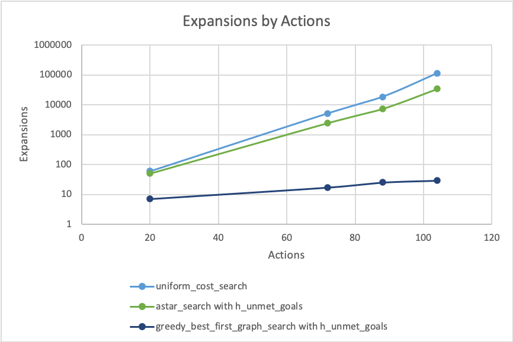
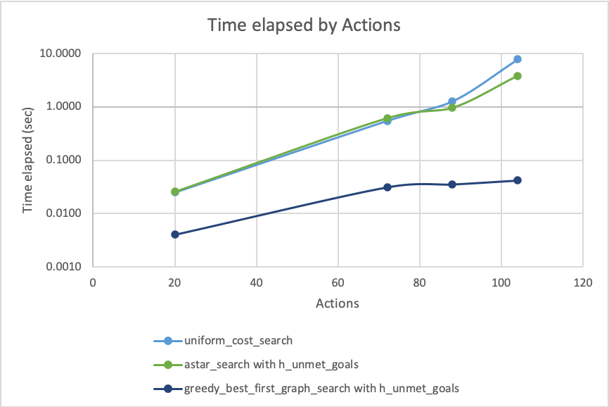

# Experiment with the planning algorithms

HanByul Yang (hanbyul.yang@gmail.com)

## Overview
This is report for a project (Build a Forward-Planning) of Udacity AI Nanodegree program.

## Result of experiments
There are 4 problems and 11 search algorithms in this project. 
I ran all of search algorithms on all 4 problems. below tables are the result of experiments.

### Air Cargo Problem 1

|Search algorithm|Actions|Expansions|Plan length|Time elapsed (sec)|Optimality|
|---|---:|--:|--:|--:|---|
|breadth first search|20|43|6|0.0197|True|
|depth first search |20|21|20|0.0089|False|
|uniform cost search |20|60|6|0.0250|True|
|greedy best first w/ unmet goals|20|7|6|0.0040|True|
|greedy best first w/ levelsum|20|6|6|0.2370|True|
|greedy best first w/ maxlevel|20|6|6|0.1302|True|
|greedy best first w/ setlevel|20|6|6|0.5705|True|
|A* w/ unmet goals|20|50|6|0.0257|True|
|A* w/ levelsum|20|28|6|0.5072|True|
|A* w/ maxlevel|20|43|6|0.3431|True|
|A* w/ setlevel|20|33|6|0.9218|True|

### Air Cargo Problem 2
|Search algorithm|Actions|Expansions|Plan length|Time elapsed (sec)|Optimality|
|---|---:|--:|--:|--:|---|
|breadth first search|72|3343|9|0.2922|True|
|depth first search |72|624|619|0.5290|False|
|uniform cost search |72|5154|9|0.5475|True|
|greedy best first w/ unmet goals|72|17|9|0.0313|True|
|greedy best first w/ levelsum|72|9|9|0.8792|True|
|greedy best first w/ maxlevel|72|27|9|0.7267|True|
|greedy best first w/ setlevel|72|9|9|2.2096|True|
|A* w/ unmet goals|72|2467|9|0.6123|True|
|A* w/ levelsum|72|357|9|11.1267|True|
|A* w/ maxlevel|72|2887|9|26.4144|True|
|A* w/ setlevel|72|1037|9|98.1614|True|

### Air Cargo Problem 3
|Search algorithm|Actions|Expansions|Plan length|Time elapsed (sec)|Optimality|
|---|---:|--:|--:|--:|---|
|breadth first search|88|14663|12|0.8581|True|
|depth first search |88|408|392|0.2396|False|
|uniform cost search |88|18510|12|1.2738|True|
|greedy best first w/ unmet goals|88|25|15|0.0355|False|
|greedy best first w/ levelsum|88|14|14|1.5522|False|
|greedy best first w/ maxlevel|88|21|13|0.9403|False|
|greedy best first w/ setlevel|88|35|17|7.4483|False|
|A* w/ unmet goals|88|7388|12|0.9595|True|
|A* w/ levelsum|88|369|12|17.2092|True|
|A* w/ maxlevel|88|9580|12|153.9378|True|
|A* w/ setlevel|88|3423|12|427.9282|True|

### Air Cargo Problem 4
|Search algorithm|Actions|Expansions|Plan length|Time elapsed (sec)|Optimality|
|---|---:|--:|--:|--:|---|
|breadth first search|104|99736|14|4.9436|True|
|depth first search |104|25174|24132|697.2099|False|
|uniform cost search |104|113339|14|7.7706|True|
|greedy best first w/ unmet goals|104|29|18|0.0421|False|
|greedy best first w/ levelsum|104|17|17|2.2335|False|
|greedy best first w/ maxlevel|104|56|17|1.8537|False|
|greedy best first w/ setlevel|104|107|23|28.8522|False|
|A* w/ unmet goals|104|34330|14|3.8185|True|
|A* w/ levelsum|104|1208|15|87.0831|False|
|A* w/ maxlevel|104|62077|14|1677.8133|True|
|A* w/ setlevel|104|22606|14|4649.6155|True|

## Analysis
The complexity of problem increases as problem number increases. So, Problem 4 is the most complex one and Problem 1 is the simplest one.
As problem gets complex, possible actions increases. Problem 1 has 20 possible actions and problem 4 has 104 possible actions. Above tables and **Figure 1** shows that number of expanded nodes increases as action increase. Expansions of All uninformed algorithms and A\* algorithms are increased exponentially as actions increase while expansions of all greedy best first algorithms are increased linearly. Uniform cost search algorithm has the most expansions in uninformed algorithms and Expansions of A\* with max level algorithm is dramatically increased among heuristic algorithms.

	 
	<b>Figure 1.</b> Expansion against the number of Actions

<!--  -->

Search time against the number of actions has similar pattern with the case of expansions. Search time of uninformed algorithms and A\* algorithms are exponentially increased and search time of greedy best first algorithms is increased linearly against the number of actions. **Figure 2** shows result of three algorithms.

	 
	<b>Figure 2.</b> Search time the number of Actions

I added optimality column to each table of problem. Optimality shows that plan length is optimal for each algorithm. Depth first search has no optimal plan length for all problems. Breadth first search and uniform cost search algorithms have optimal plan length for all problems. Above tables show that plan lengths of all A\* algorithms except level sum heuristic are optimal. Greedy best first algorithms have optimal plan length in problem 1 and 2 but they are not optimal with problem 3 and 4.

## Result Answers
- **Which algorithm or algorithms would be most appropriate for planning in a very restricted domain (i.e., one that has only a few actions) and needs to operate in real time?**

	I think greedy best first with unmet goals algorithm is the most appropriate algorithm in very restrict domain. Because it is the fastest  and it performed under 0.1 second even though it has no optimal plan length. 

- **Which algorithm or algorithms would be most appropriate for planning in very large domains (e.g., planning delivery routes for all UPS drivers in the U.S. on a given day)?**

	I think that A\* with unmet goals and breadth first search are the most appropriate for planning in very large domain. They have optimal path length for all problems, and They perform much faster than any other algorithms with problem 4.

- **Which algorithm or algorithms would be most appropriate for planning problems where it is important to find only optimal plans?**

	A\* with unmet goals, breadth first search and uniform cost search would be the most appropriate to find only optimal plans. They found the optimal plan for all 4 problems and performs much better than other optimal algorithms.